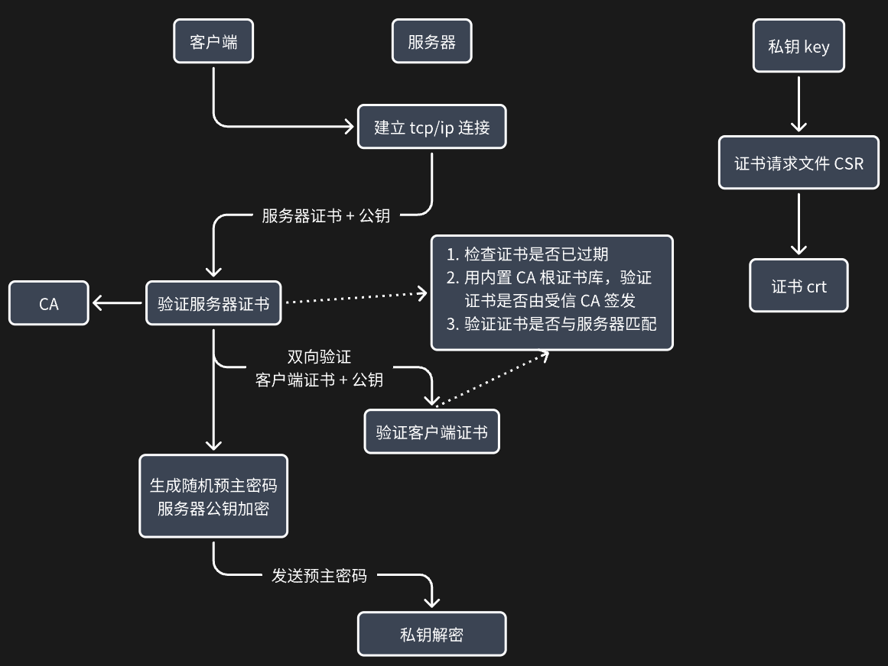

## 基本概念
- 私钥：私密部分
  - 解密公钥加密的数据
  - 数字签名：私钥对数据生成此数据的数字签名摘要信息
- 公钥：公开部分
  - 公钥加密数据，只有私钥才能解
  - 数字签名：验证使用私钥签名的数据
- 证书：由证书颁发机构 CA 签发的电子文档，包含公钥和身份信息（CN，DN，SAN）
- 证书颁发机构 CA：受信的第三方，负责验证和签发证书
- 证书链：指实体证书经过中间证书最终到根证书的一系列证书。这样可以通过证书链可追溯到一个受信任的根证书，从而验证证书的真实性。

## 怎样验证证书是否与服务器匹配？
  - 主要是检查证书中的主机名与客户端请求的服务器地址是否一致
  - 旧的证书格式中，通常是用 CN 进行匹配
  - SAN (Subject Alternative Name) 现代证书允许配置多个域名或IP匹配规则
    - 完全匹配，通配符匹配（*只匹配本级，不能跨级匹配），部分匹配

## SAN 通配符
- 通配符 `*` 只能在域名的 左侧
- 只能是子域名，不能用于顶级域名，如：*.com 或 *.example.com 都是无效的
  - 所以通配证书SAN必须同时配置：*.example.com,example.com，因 example.com 是顶级域名
- **单层通配：**`*.example.com` 可匹配 `sub.example.com`，但不能匹配 `sub.sub.example.com`，因只能代替一个子域名层次。
- 不支持多层通配：如 `*.*.example.com`

## SSL/TLS 认证过程
