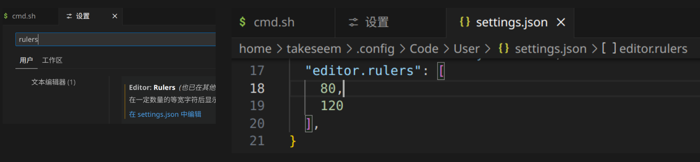

## 安装
- [Visual Studio Code](https://code.visualstudio.com/)

## 插件
### 常用
- [简体中文语言包](https://marketplace.visualstudio.com/items?itemName=MS-CEINTL.vscode-language-pack-zh-hans)
- [Reload](https://marketplace.visualstudio.com/items?itemName=natqe.reload)（推荐）：用于解决 IDE 界面出错或项目错误更新不及时的问题。
  - 点击右下角 Reload 按钮重启 IDE。
- [Docker](https://marketplace.visualstudio.com/items?itemName=ms-azuretools.vscode-docker)（推荐）：使用非常方便。
- [ESLint](https://marketplace.visualstudio.com/items?itemName=dbaeumer.vscode-eslint)（推荐）：用于代码规范检查。
- [Prettier](https://marketplace.visualstudio.com/items?itemName=esbenp.prettier-vscode)：代码格式化。我不喜欢使用 Prettier，格式化后会影响阅读，我一般使用 vscode 自带的格式化。
  - 保存并自动格式化：看需要吧，对于项目维护不建议启用
  - ESLint 预设包含格式化规则可能与 Prettier 冲突：建议使用 eslint-config-prettier 禁用 ESLint 预设中的所有格式化规则，让 ESLint 只捕捉逻辑错误
  - 如果想在合并 PR 前强制执行文件格式化：CI 中使用 prettier --check 命令

### AI 插件
- [Fitten Code](https://code.fittentech.com/tutor_vscode_zh)
  - 已使用 1 个月，日常代码开发帮助很大。
- [通义灵码](https://tongyi.aliyun.com/lingma/download)
  - 写下这篇博客时，才开始使用体验，后续再来对比和 Fitten Code 差别。

### 数据库
- [Database Client](https://marketplace.visualstudio.com/items?itemName=cweijan.vscode-database-client2)：支持 MySQL、SQLite、PostgreSQL、MongoDB 等数据库，免费版基本够用。

## QA
- 全局配置：~/.config/Code/User/settings.json
  - 默认文档格式化配置、编辑器 rulers 配置 等
- 设置编辑页宽为 80 和 120，打开设置（`ctrl + ,`）：文件 -> 首选项 -> 设置，搜索：editor.rulers
  
