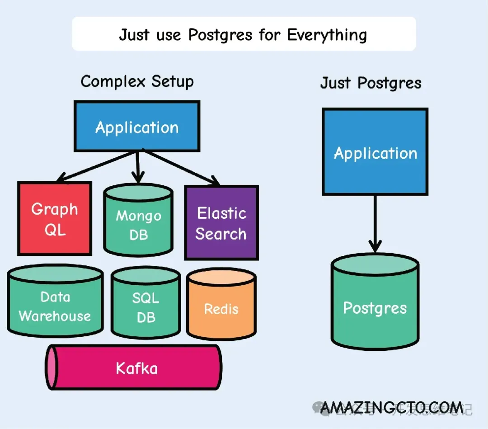

**PostgreSQL 支持 json 有十多年了，我一直有一个疑问能用 PostgreSQL 代替 MongoDB 吗？**

通过群友挖掘到一篇文章：[Just Use Postgres for Everything](https://www.amazingcto.com/postgres-for-everything/)

引用了一篇 2020-07-17 的文章详细介绍了 JSONB

[Using JSONB in PostgreSQL®: How to Effectively Store & Index JSON Data in PostgreSQL](https://scalegrid.io/blog/using-jsonb-in-postgresql-how-to-effectively-store-index-json-data-in-postgresql/)

- 大多数情况使用 JSONB
- 使用 JSON 的场景：
  - 需保留原始格式
  - 需保留重复 keys
  - JSON 提取速度更快（如果需进行 json 操作时 JSONB 更快）
- JSONB 缺点
  - PostgreSQL 不存储 JSONB 列的列统计信息，有时会导致错误的查询计划选择，如嵌套循环和哈希连接等
  - SONB 占用较大的存储空间：
    - JSONB 不会对 json 的键名进行重复数据删除，占用空间比 WiredTiger 上的 MongoDB BSON 或传统列存储大得多
    - 解决方案
      - 使用短名，如：“pb” 代替 “publisherName”
			- 经常出现的键名提取为表的传统列字段

最终挖掘到一篇 2017-12-21 写的 MySQL、PostgreSQL、MongoDB json 性能对比
[Jsonb: few more stories about the performance （2017-12-21）](https://erthalion.info/2017/12/21/advanced-json-benchmarks/)

- 大多数情况下可以使用数据库代替 NoSQL 数据库
- TOAST TOAST_TUPLE_THRESHOLD 默认 2KB 对性能有一定影响
- 压缩对 cpu 也有一定影响

其他参考：
- postgresql之物理存储结构
- TOAST 数据库物理存储

**结论：可以使用 PostgreSQL 代替 MongoDB**