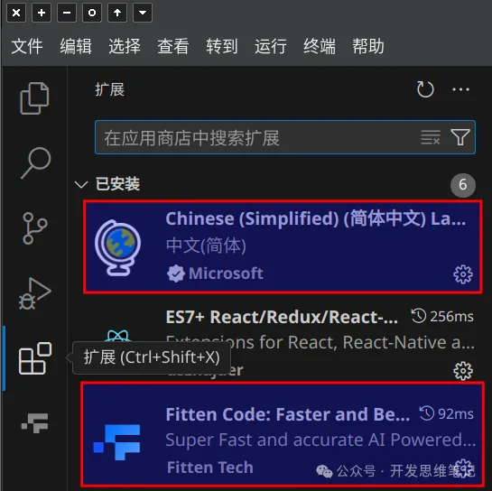
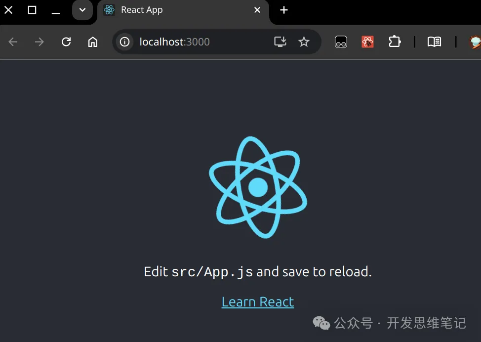
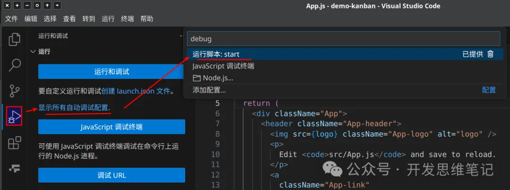
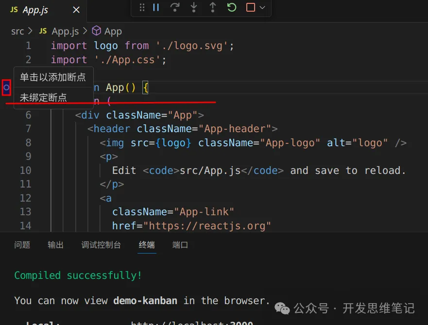
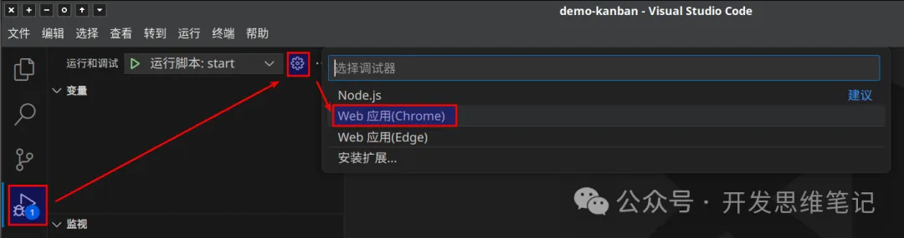
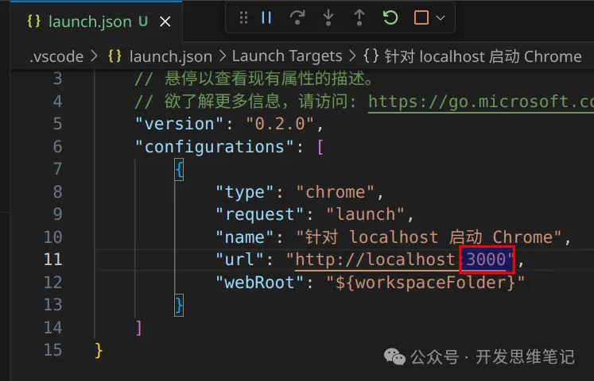
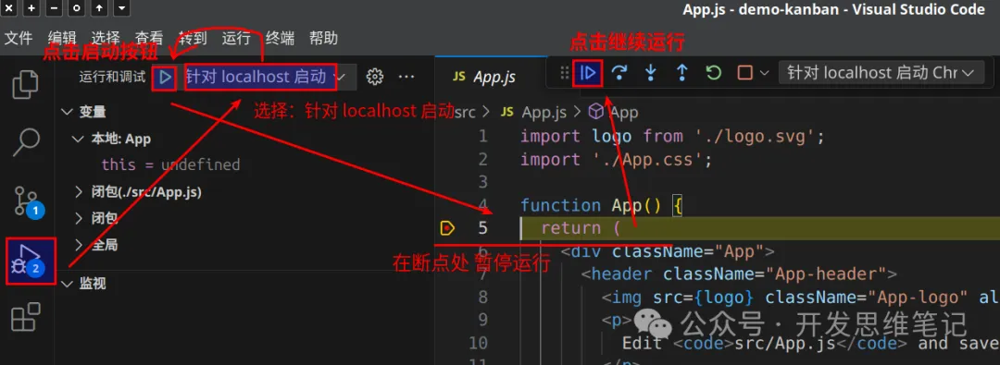
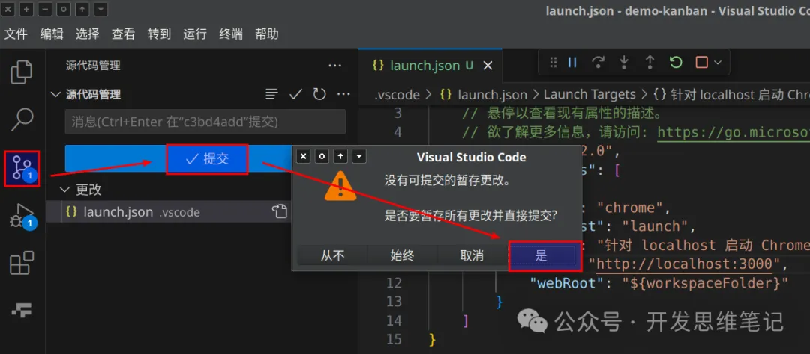

在前端开发的世界里，React 是一个备受欢迎的框架，它不仅应用广泛，且上手快、扩展性强。如果你是一名刚开始接触 React 的开发者，本文将会是你启动 React 项目的最佳指南。通过这篇文章，你将学会如何从零搭建一个 React 项目，并成功运行它。

## 步骤一：安装 fnm 和 Node.js

React 项目的基础是 Node.js，选择合适的 Node 版本是成功运行项目的关键。为此，我们推荐使用 fnm 作为 Node.js 版本管理工具，它操作简单、性能出色，特别适合多版本 Node.js 的切换和管理。

1. 安装 FNM 工具
首先，我们需要安装 FNM。以下是适用于 Linux 系统的安装步骤：
```bash
# 安装 fnm (Fast Node Manager)
curl -fsSL https://fnm.vercel.app/install | bash
# 激活 fnm
source ~/.bashrc
```

2. 安装 Node.js
使用 FNM 安装指定的 Node.js 版本。我们以 Node.js 22 为例：
```bash
# 安装并使用 Node.js v22
fnm use --install-if-missing 22
# 验证 Node.js 版本
node -v  # 结果应为 v22.9.0
# 验证 npm 版本
npm -v  # 结果应为 10.8.3
```
你可以根据项目的需求自由选择合适的 Node.js 版本。

## 步骤二：使用 Create React App 创建项目

现在 Node.js 环境已经搭建完毕，接下来就是创建 React 项目了。我们使用 Facebook 官方推荐的工具 Create React App 快速生成项目模板。

首先我们为项目创建一个工作目录，再用 npx 来创建 React 项目：
```bash
mkdir -p node && cd node
npx create-react-app demo-kanban
```

Create React App 会自动为你生成基础的项目结构，包含必要的依赖和配置，非常适合初学者快速上手。


## 步骤三：版本控制 - Git 初始提交
为了更好地管理代码，我们可以通过 Git 初始化项目仓库并提交初始代码：
```bash
cd demo-kanban
git init
git add .
git commit -m '初始导入'
```
通过 Git 进行版本管理，不仅可以记录项目的历史，还能轻松与团队协作。

git 下载：https://git-scm.com/downloads

## 步骤四：安装开发工具（IDE）
在开发过程中，选择一个合适的编辑器将极大提升你的效率。这里推荐使用 Visual Studio Code (VSCode)，它不仅免费且功能强大，还拥有丰富的插件支持。如果你愿意尝试收费的 IDE，WebStorm 也是一个不错的选择，提供 30 天试用期。

vscode 下载：https://code.visualstudio.com/

推荐安装的插件
- 简体中文语言包：优化中文用户的使用体验。
- 国产 AI 辅助编程插件 Fitten Code：智能代码补全，提升开发效率。


## 步骤五：运行和调试 React 项目
现在，我们已经准备好了 React 项目，接下来就是启动和调试项目了。

1. 启动项目
> 使用 VSCode 打开项目文件夹 demo-kanban，然后通过以下两种方式启动服务：
  - 方法一：在终端启动（按下快捷键 `Ctrl + `` 打开终端），输入以下命令：`npm start`，服务启动成功后，浏览器会自动打开项目主页 [http://localhost:3000/](http://localhost:3000/)
    
  - 方法二：使用 VSCode 的“运行和调试”功能，点击 VSCode 界面左侧的“运行和调试”按钮，选择 start 脚本来启动项目。
    

2. 调试项目
> 如果你想调试客户端代码，可以按如下步骤操作：
  - 在 function App() 函数左侧点击，设置断点

    

  - 修改调试配置，将默认端口从 8080 修改为 3000，以匹配 React 开发服务器的端口
  
    
    

  - 启动 Web 调试，开始实时调试代码

    

## 步骤六：保存工作成果——提交代码

在代码开发的过程中，良好的提交习惯是非常重要的。每次提交代码时，都应该确保提交信息清晰、简洁，能够准确反映此次代码更改的内容。以下是提交代码时的一些建议：

**代码提交的最佳实践**
1. 原子性提交：每次提交应尽量包含单一的功能或改动，确保每个提交都能独立存在且不会破坏项目的运行。这有助于日后回溯和查找问题时更加方便。
2. 提交信息清晰有力：提交信息应该简洁明了，能够准确描述此次提交的目的。例如：
```bash
git commit -m "新增登录功能"
git commit -m "修复首页加载缓慢的问题"
```
3. 频繁提交，保持进度：频繁的小幅提交不仅能记录开发过程中的每一个步骤，还可以减少回滚时的工作量。如果一次提交过多内容，不仅不利于回溯，也容易混淆具体的更改细节。
4. 代码提交前的自检：提交之前，记得检查代码是否通过所有单元测试，确保没有语法错误、未完成的部分或临时调试代码。


## 步骤七：React 开发工具
为了更方便地调试 React 组件状态和性能，我们推荐 [安装 React Developer Tools](https://chromewebstore.google.com/detail/react-developer-tools/fmkadmapgofadopljbjfkapdkoienihi?hl=zh)，这是一款非常实用的 Chrome 浏览器扩展，帮助你深入了解 React 组件树的内部工作原理。


## 总结
通过本文，你应该已经学会了如何从零开始搭建一个 React 项目，并顺利运行它。无论是 Node.js 环境的安装，还是使用 Create React App 快速生成项目，接下来你都可以更加顺畅地投入到 React 的学习和开发中。

如果你觉得这篇文章对你有帮助，请不要忘记点赞、转发和收藏！你的关注是我继续输出优质内容的动力，也让我为大家带来更多干货和实战技巧！感恩每一位读者的支持与鼓励！ 🙌