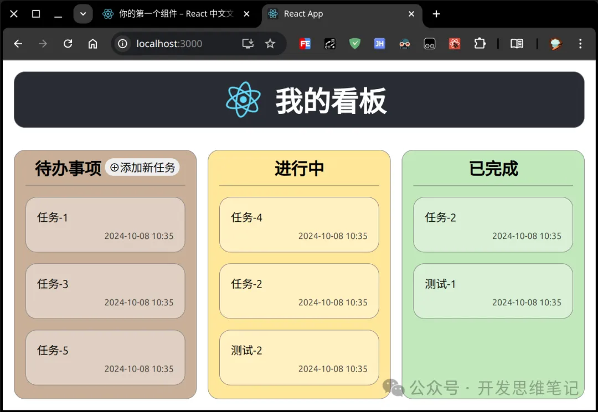
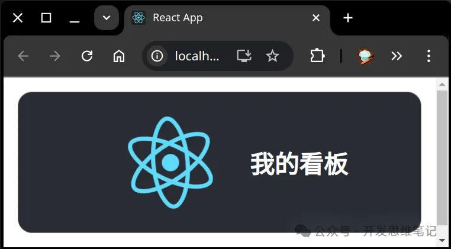
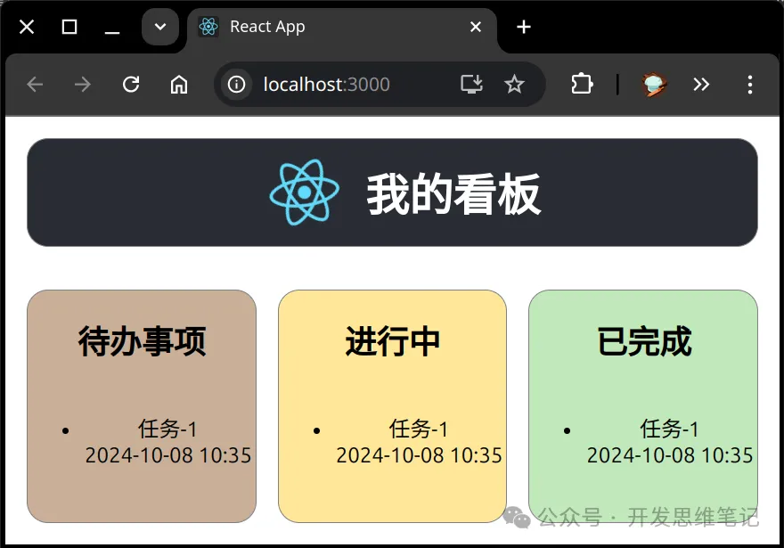
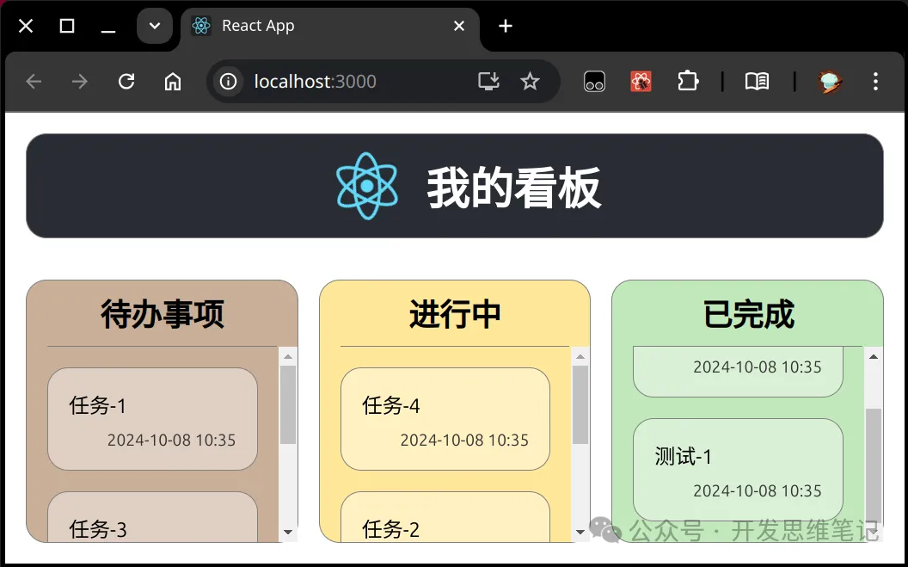
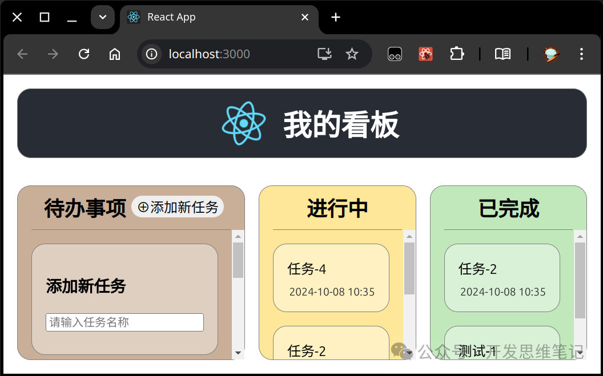
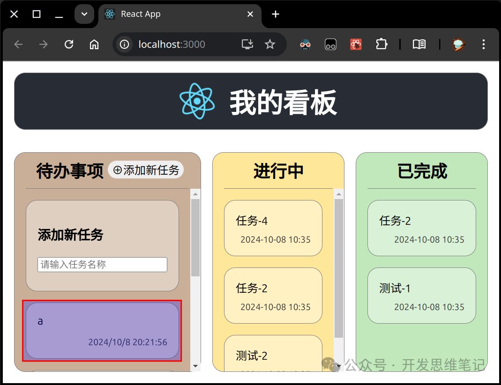
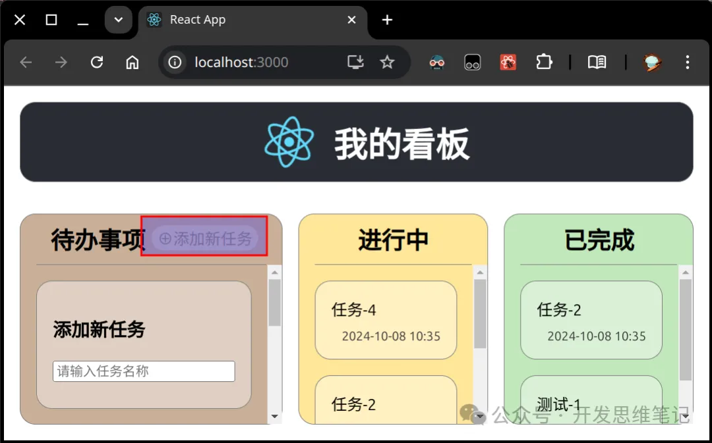

在这一讲中，我们将着手实现第一个完整的 React 项目 —— 我的看板。通过这个项目，你将逐步了解如何从 UI 界面到业务逻辑，按步骤开发一个实用的任务管理工具。

## UI 界面

首先，我们来看看最终的 UI 界面设计：



## 开发思路

在开始开发之前，我们的思路是清晰的，整个项目将按照以下顺序进行：

1. 开发 UI： 从简单到复杂，从外到内。
1. 实现业务逻辑： 也是从简单到复杂，逐步完善功能。

源码托管在 [GitHub](https://github.com/takeseem/demo-kanban)

## 搭建项目 demo-kanban

参考上一讲：[React 项目搭建与运行：从零开始你的 React 之旅](react-env.md)

## Header UI 调整
我们从修改 App.js 文件开始，为应用增加一个更直观的标题 —— “我的看板”。原有的默认内容被替换，下面是具体的代码调整

- App.js 中增加 “我的看板”，代码调整如下：
```jsx
       <header className="App-header">
         
-        <p>
-          Edit <code>src/App.js</code> and save to reload.
-        </p>
-        <a
-          className="App-link"
-          href="https://reactjs.org"
-          target="_blank"
-          rel="noopener noreferrer"
-        >
-          Learn React
-        </a>
+        <h1>我的看板</h1>
       </header>
```
- 对应的 App.css 中，我们对页面布局进行了优化，使整个页面使用 flex 布局，使得界面更适应不同设备的屏幕尺寸。
  - .App：使用 flex，100vh 表示高度将占满整个视口的高度
  - .App-header：flex 方向设置为 row，添加圆角边框
  - margin：边框到外部组件的距离
```css
@@ -1,9 +1,12 @@
 .App {
+  height: 100vh;
+  display: flex;
+  flex-direction: column;
   text-align: center;
 }
 
 .App-logo {
-  height: 40vmin;
+  height: 80%;
   pointer-events: none;
 }
 
@@ -15,19 +18,18 @@
 
 .App-header {
   background-color: #282c34;
-  min-height: 100vh;
+  min-height: 5rem;
   display: flex;
-  flex-direction: column;
+  flex-direction: row;
+  border: 1px solid gray;
+  border-radius: 1rem;
+  margin: 1rem;
   align-items: center;
   justify-content: center;
   font-size: calc(10px + 2vmin);
   color: white;
 }
 
-.App-link {
-  color: #61dafb;
-}
-
 @keyframes App-logo-spin {
   from {
     transform: rotate(0deg);
```
- 运行效果如图 [commit](https://github.com/takeseem/demo-kanban/commit/4b428b163184da1156a33e3a4812bcecd5116568)


## 看板 UI 初步实现
- 我们继续在 App.js 中实现看板的三个核心部分：待办事项、进行中、已完成
```jsx
<main className="kanban-board">
  <section className='kanban-column column-todo'>
    <h2>待办事项</h2>
    <ul>
      <li>任务-1</li>
    </ul>
  </section>
  <section className='kanban-column column-ongoing'>
    <h2>进行中</h2>
    <ul>
      <li>任务-1</li>
    </ul>
  </section>
  <section className='kanban-column column-done'>
    <h2>已完成</h2>
    <ul>
      <li>任务-1</li>
    </ul>
  </section>
</main>
```
- 同时，我们在 App.css 中添加了对应的样式，使每个看板列的外观更加美观。
  - header 的 flex 定义为 1，kanban-board 的 flex 定义为 10，意思是 header 在主轴上（column 列方向）占据 1/(1+10)，board 占据 10/11，flex 用来控制怎样填充空间
  - [flex 参考](https://developer.mozilla.org/zh-CN/docs/Web/CSS/flex)
```css
.kanban-board {
  display: flex;
  gap: 1rem;
}
.kanban-column {
  flex: 1;
  border: 1px solid gray;
  border-radius: 1rem;
  padding: 1rem;
}
```
- 运行效果如图
  - [commit](https://github.com/takeseem/demo-kanban/commit/1a9d84fcefc40ad9f4ddfd5e39ce301a0486282c)
  

## 看板 UI 效果调整
- App.js 添加 CSS 引用
- App.css 实现看板标题 和 任务卡 的 CSS 效果
- 运行效果如图
  - [commit](https://github.com/takeseem/demo-kanban/commit/00dd9f3629e0527cd3bf3e71cff41fc03fc59ad7)
  

## 任务卡组件化
为了提高代码的复用性和可维护性，我们将任务卡片抽取为 KanbanCardList 组件。通过这种方式，你可以轻松地管理和更新任务列表中的每一项。

- [自定义组件参考](https://zh-hans.react.dev/learn/your-first-component)
```jsx
const KanbanCard = ({ title, time }) => (
  <li className='kanban-card'>
    <div className='card-title'>{title}</div>
    <div className='card-time'>{time}</div>
  </li>
);
const KanbanCardList = ({ list }) => list.map(item => <KanbanCard {...item} />);
```
- 运行效果如图 [commit](https://github.com/takeseem/demo-kanban/commit/6064e7d3247d2124eec14df3fcfd56001db2d165)
  

## 添加任务功能

我们还在看板的 “待办事项” 列中添加了 “新任务” 的功能，用户可以通过输入框快速添加新任务。
- App.js
```jsx
const KanbanNewCard = () => (
  <li className='kanban-card'>
    <h3>添加新任务</h3>
    <div className='card-title'>
      <input type='text' placeholder='请输入任务名称' />
    </div>
  </li>
);
```
- App.css 增加 添加按钮的 CSS 代码
```css
.kanban-column > h2 > button {
  float: right;
  border: 0;
  border-radius: 1rem;
  font-size: 1rem;
  margin-top: 0.2rem;
}
```
- 运行效果如图 [commit](https://github.com/takeseem/demo-kanban/commit/83e0e9e377bb91750ec20d36c92dfcd54fe84d91)
  

## 实现添加逻辑
- App.js 实现添加逻辑 [commit](https://github.com/takeseem/demo-kanban/commit/7f33a70a9fb8f7e8f887b0b0a38fdee846684010)
- bug：修复新增任务界面无反映问题，[commit](https://github.com/takeseem/demo-kanban/commit/739bb6f15393a589f46e4d637160614c27fcbf34)
- bug：要用回调修改状态，不要直接用状态变量，避免异步导致状态问题，[commit](https://github.com/takeseem/demo-kanban/commit/83d5a36b6566e04ace5d271c75954de4b2ee2e33)
  - 参考：[根据先前的 state 更新 state](https://zh-hans.react.dev/reference/react/useState#updating-state-based-on-the-previous-state)
- 最终运行效果
  

## 添加按钮 disable 逻辑
- App.js，[commit](https://github.com/takeseem/demo-kanban/commit/f158d88d0181c4b1a6dedf8ddddfc53bab717932)
```jsx
  const [showAdd, setShowAdd] = useState(false);
  const handleAddClick = () => {
    setShowAdd(true);
  };
  const handleSubmit = (title) => {
    setTodoList(old => [{ title, time: new Date().toLocaleString() }, ...old]);
    setShowAdd(false);
  };
```


## 添加任务时自动获得焦点
- App.js，[commit](https://github.com/takeseem/demo-kanban/commit/3f5218f5e440af45f306fce71bbf024e5aac3625)
```jsx
    // 使用 useRef 创建 input 的引用
    const inputRef = useRef(null);
    // 使用 useEffect 在组件渲染后调用 focus
    useEffect(() => {
      if (inputRef.current) {
        inputRef.current.focus(); // 让 input 元素获得焦点
      }
    }, []); // 空数组确保这个 effect 只在初次渲染时运行一次
```

## 总结：

通过本次实战项目，我们成功实现了一个基础的 React 看板应用。这个项目不仅展示了如何进行组件化开发，还演示了如何高效管理任务列表。你可以继续扩展这个项目，添加更多功能，如拖拽任务、任务过滤等。

如果你觉得这篇文章对你有帮助，请不要忘记点赞、转发和收藏！你的关注是我继续输出优质内容的动力，也让我为大家带来更多干货和实战技巧！感恩每一位读者的支持与鼓励！🙌

- [React 看板项目源码](https://github.com/takeseem/demo-kanban)
- [flex MDN 参考](https://developer.mozilla.org/zh-CN/docs/Web/CSS/flex)
- [React自定义组件](https://zh-hans.react.dev/learn/your-first-component)
- [React useState 更新 state](https://zh-hans.react.dev/reference/react/useState#updating-state-based-on-the-previous-state)
- [React 使用 useRef 和 useEffect 实现 input 自动获得焦点](https://zh-hans.react.dev/reference/react/useRef#manipulating-the-dom-with-a-refhttps://zh-hans.react.dev/reference/react/useEffect#reference)