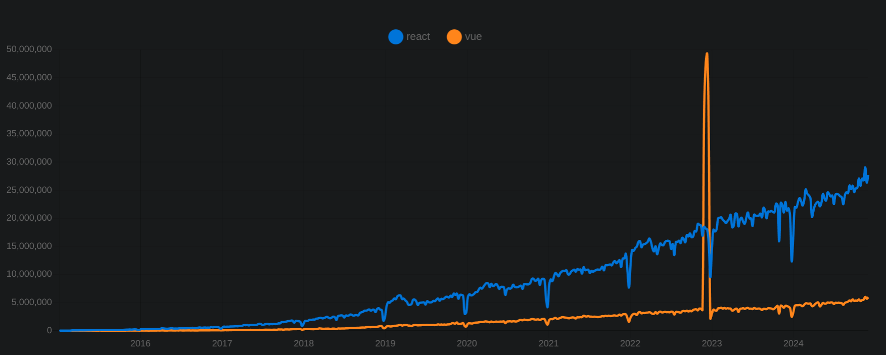

- [React 技术栈 2025](https://www.robinwieruch.de/react-tech-stack/)
- [迈向下一步](https://www.road-to-next.com/)

## 学习 React 的好处
- 就业：全球 Web 开发首选框架、全栈工程师的首选
- [React](https://zh-hans.react.dev/)：全球第一，既能构建 Web 应用，又能构建原生应用。
  - 用组件创建用户界面、用代码和标签编写组件、可在任何 HTML 页面中添加 React
  - 全栈 React 开发框架：[Next.js](https://nextjs.org/)、[Remix](https://remix.run/)
  - 社区有数百万人
- [React vs Vue](https://npmtrends.com/react-vs-vue)

  


## React 开发环境
### Node 环境搭建
- 安装 [fnm](https://github.com/Schniz/fnm)
  ```bash
  # 安装 fnm (Fast Node Manager)
  curl -fsSL https://fnm.vercel.app/install | bash
  # 激活 fnm
  source ~/.bashrc
  ```
- 安装 [Node.js](https://nodejs.org/en/download/package-manager)
  ```bash
  # 安装并使用 Node.js v22
  fnm use --install-if-missing 22
  # 验证 Node.js 和 npm 版本
  node -v
  npm -v
  ```
- 使用 [Corepack](https://nodejs.org/api/corepack.html) 安装 [pnpm](https://pnpm.io/installation#using-corepack)（pnpm 更快更省空间）
  ```bash
  corepack enable pnpm
  ```
- Node 环境一键升级脚本：`node-upgrade.sh`
  ```bash
  #!/bin/bash

  function fnmUpgrade() {
    local ver0=$(fnm --version)
    echo "upgrade: fnm $ver0"
    curl -fsSL https://fnm.vercel.app/install | bash -s -- --skip-shell
    local ver=$(fnm --version)
    if [ "$ver0" = "$ver" ]; then
      echo "fnm $ver0 nothing to change"
    else
      echo "fnm $ver0 upgrade to $ver"
    fi
  }

  function nodeUpgrade() {
    local ver=$(fnm ls-remote --latest)
    if [ ! -z "$(fnm ls|grep $ver)" ]; then
      echo "node $ver is latest"
      return 0
    fi
    
    local old="node: $(node -v), npm: $(npm -v)"
    fnm install $ver
    fnm default $ver
    local now="node: $(node -v), npm: $(npm -v)"
    
    echo "node upgrade from"
    echo "\t$old"
    echo "\t$now"
  }

  function pmUpgrade() {
    echo "pnpm: $(corepack pnpm -v)"
    corepack use pnpm@latest
    corepack enable pnpm
  }

  fnmUpgrade
  nodeUpgrade
  pmUpgrade
  ```

### IDE
- 推荐安装：[vscode](/code/IDE/vscode)
- 在线 IDE：[react.new](https://react.new)


## React 项目搭建
- 使用 [vite](https://vite.dev/guide/#scaffolding-your-first-vite-project) 创建 React 项目
  ```bash
  # bash 中执行，项目名称：my-app，模板：react-swc-ts
  pnpm create vite my-app --template react-swc-ts

  # 创建成功后，进入项目目录启动项目
  cd my-app
  pnpm i
  pnpm run dev
  ```
  - 打开测试：[http://localhost:5173/](http://localhost:5173/)
  - 使用`.`在当前目录创建项目：`pnpm create vite . --template react-swc-ts`
  - 使用 vite 一步一步创建项目：`pnpm create vite`
- 升级 React 19
  ```bash
  pnpm i react@latest react-dom@latest
  pnpm i -D @types/react@latest @types/react-dom@latest \
    @vitejs/plugin-react-swc@latest eslint-plugin-react-hooks@latest \
    eslint-plugin-react-refresh@latest 
  ```
- 升级所有的包
  ```bash
  pnpm i react@latest react-dom@latest
  pnpm i -D @eslint/js@latest @types/react@latest @types/react-dom@latest \
    @vitejs/plugin-react-swc@latest \
    eslint@latest eslint-plugin-react-hooks@latest eslint-plugin-react-refresh@latest \
    globals@latest typescript@latest typescript-eslint@latest \
    vite@latest
  ```

## 集成 tailwindcss
- [tailwindcss](https://tailwindcss.com/docs/guides/vite)
  ```bash
  # 进入项目目录
  cd my-app

  # 添加依赖
  pnpm install -D tailwindcss postcss autoprefixer

  # 创建 tailwind 和 postcss 配置文件
  ## tailwind.config.js 和 postcss.config.js
  npx tailwindcss init -p
  ```
- 配置：tailwind.config.js
  ```js{3-6} title="tailwind.config.js"
  /** @type {import('tailwindcss').Config} */
  export default {
    content: [
      "./index.html",
      "./src/**/*.{js,ts,jsx,tsx}",
    ],
    theme: {
      extend: {},
    },
    plugins: [],
  }
  ```
- 新建 scss 文件：src/assets/styles/tailwind.scss
  ```css title="src/assets/styles/tailwind.scss"
  @tailwind base;
  @tailwind components;
  @tailwind utilities;
  ```
- 在 main.tsx 中引入
  ```tsx title="main.tsx"
  import "./assets/styles/tailwind.scss";
  ```
- 测试效果，修改： App.tsx 内容如下
  ```tsx title="App.tsx"
  function App() {
    return (
      <div className="bg-red-800 text-white text-bold text-3xl">
        Hello world!
      </div>
    )
  }
  export default App
  ```

- [tailwind Editor 安装](https://tailwindcss.com/docs/editor-setup#intelli-sense-for-vs-code)：[Tailwind CSS IntelliSense
](https://marketplace.visualstudio.com/items?itemName=bradlc.vscode-tailwindcss)

## 集成 shadcn-ui
- [shadcn/ui](https://ui.shadcn.com/)：[Github](https://github.com/shadcn-ui/ui)、[安装](https://ui.shadcn.com/docs/installation)
- [vite 集成 shadcn-ui](https://ui.shadcn.com/docs/installation/vite)
- 修改 `tsconfig.json` 添加 `compilerOptions`
  ```json{7-12} title="tsconfig.json"
  {
    "files": [],
    "references": [
      { "path": "./tsconfig.app.json" },
      { "path": "./tsconfig.node.json" }
    ],
    "compilerOptions": {
      "baseUrl": ".",
      "paths": {
        "@/*": ["./src/*"]
      }
    },
  }
  ```
- 修改 `tsconfig.app.json`
  ```json{5-10} title="tsconfig.app.json"
  {
    "compilerOptions": {
      // ...
      // 集成 shadcn-ui
      "baseUrl": ".",
      "paths": {
        "@/*": [
          "./src/*"
        ]
      },
    },
    // ...
  }
  ```
- 修改 `vite.config.ts`
  - 安装依赖：`pnpm i -D @types/node`
  - 修改 `vite.config.ts`
    ```ts{3,8-12} title="vite.config.ts"
    import { defineConfig } from 'vite'
    import react from '@vitejs/plugin-react-swc'
    import path from 'path'

    // https://vite.dev/config/
    export default defineConfig({
      plugins: [react()],
      resolve: {
        alias: {
          "@": path.resolve(__dirname, "./src"),
        },
      },
    })
    ```
- 初始化 shadcn-ui
  - 执行命令：`pnpm dlx shadcn@latest init`
  - 生成配置文件：`components.json`
- 使用例子：添加一个按钮组件
  - 执行命令：`pnpm dlx shadcn@latest add button`
  - 生成组件：`src/components/Button.tsx`
  - 使用这个组件，修改：`App.tsx`
    ```tsx title="App.tsx"
    import { Button } from "./components/ui/button"

    function App() {
      return (
        <div>
          <Button>Click me</Button>
        </div>
      )
    }
    export default App
    ```
    
- vscode 插件
  - [shadcn-ui 命令插件](https://github.com/SuhelMakkad/vscode-shadcn-ui)：快速安装 shadcn-ui 组件
    - ctrl + shift + p：输入：`shadcn`

    
    
  - [shadcn/ui snippets](https://github.com/nrjdalal/shadcn-ui-snippets#readme)：代码中快速导入和快速添加 shadcn-ui 组件
    - 代码中输入：`cni-xxx` 快速导入 xxx 组件
    - 代码中输入：`cnx-xxx` 快速添加 xxx 组件