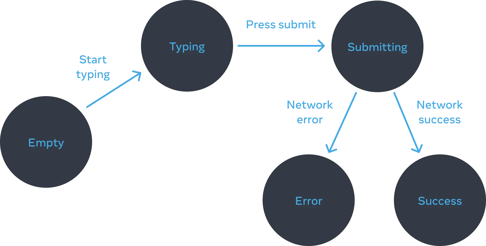

## 参考
- [React 官方文档](https://zh-hans.react.dev/learn/managing-state)
- [demo](https://www.takeseem.com/demo-react/demo/react-state)

## 将 UI 视为 state
### 声明式 UI 编程与命令式 UI 编程有何不同？
- 命令式编程：你坐在车上然后一步一步的告诉他该去哪儿。
  - 他不知道你想要去哪儿，所以他只能根据你的指令来行动。
  - 你必须知道执行的每个细节和步骤，并处理每个可能的错误。
- 声明式编程：你告诉他要去哪儿，然后他去了。
  - 你只需告诉他要去哪儿，而不是事无巨细的告诉他如何走，他就会将你带到目的地。
  - 你只需声明你想要的，React 会计算出如何去更新 UI。

### 怎样声明式地考虑 UI？
1. `定位`你的组件中不同的视图状态
  - 如表单：未填写、输入中、提交中、成功时、错误时。
2. `确定`是什么触发了这些 `state` 的改变
  - 人为输入：点击、填写内容、点击导航链接等，通常需要：[事件处理函数](https://zh-hans.react.dev/learn/responding-to-events)
  - 计算机输入：网络请求反馈、定时器、加载图片等。
  - 如：表单的各种状态：
  
3. `表示`内存中的 state（需要使用 `useState`）
4. `删除`任何不必要的 state 变量
  - 怎样找出不必要的 state 变量？问问自己：
    - `这个 state 是否会导致矛盾？`例如，isTyping 与 isSubmitting 的状态不能同时为 true。矛盾的产生通常说明了这个 state 没有足够的约束条件。两个布尔值有四种可能的组合，但是只有三种对应有效的状态。为了将“不可能”的状态移除，你可以将他们合并到一个 'status' 中，它的值必须是 'typing'、'submitting' 以及 'success' 这三个中的一个。
    - `相同的信息是否已经在另一个 state 变量中存在？`另一个矛盾：isEmpty 和 isTyping 不能同时为 true。通过使它们成为独立的 state 变量，可能会导致它们不同步并导致 bug。幸运的是，你可以移除 isEmpty 转而用 message.length === 0。
    - `你是否可以通过另一个 state 变量的相反值得到相同的信息？`isError 是多余的，因为你可以检查 error !== null。
  - 通过 [将状态提取到一个 reducer 中](https://zh-hans.react.dev/learn/extracting-state-logic-into-a-reducer) 减少“不可能” state
5. `连接`事件处理函数去设置 state

### 尝试一些挑战
- 务必完成官方：[尝试一些挑战](https://zh-hans.react.dev/learn/reacting-to-input-with-state#challenges)：务必 Fork 再修复以避免内嵌导致的一些莫名其妙错误。
  - `添加和删除一个 CSS class` 收获：useState 的使用，事件冒泡。
  - `个人信息编辑器` 收获：React 很简单，form submit 默认行为处理。
  - `不使用 React 去重构命令式的解决方案` 收获：怎样用 JS 直接操作 DOM，深刻体会 React 的优势。

## 如何组织好 state 状态结构？
### state 构建原则
1. `合并关联的 state`：如果总是同时更新两个或更多 state，考虑将它们合为一个单独的 state 变量。
1. `避免矛盾的 state`：应尽量避免 state 结构中存在多个相互矛盾或“不一致”的 state。
1. `避免冗余的 state`：如果能在渲染期间从组件的 props 或其现有的 state 变量中计算出一些信息，则不应将这些信息放入 state 中。
1. `避免重复的 state`：当同一数据在多个 state 变量之间或在多个嵌套对象中重复时，很难保持它们同步。应尽可能减少重复。
1. `避免深度嵌套的 state`：深度分层的 state 更新起来不方便，最好以扁平化方式构建 state。有时候可以将一些嵌套 state 移动到子组件中来减少 state 的嵌套，通常是不需要保持的短暂 UI 状态，如：一个选项是否被悬停。

### 摘要
- 如果两个 state 变量总是一起更新，请考虑将它们合并为一个。
- 仔细选择你的 state 变量，以避免创建“极难处理”的 state。
- 用一种减少出错更新的机会的方式来构建你的 state。
- 避免冗余和重复的 state，这样你就不需要保持同步。
- 除非你特别想防止更新，否则不要将 props 放入 state 中。
- 对于选择类型的 UI 模式，请在 state 中保存 ID 或索引而不是对象本身。
- 如果深度嵌套 state 更新很复杂，请尝试将其展开扁平化。

### 尝试一些挑战
- 务必完成官方：[尝试一些挑战](https://zh-hans.react.dev/learn/choosing-the-state-structure#challenges) 务必 Fork 再修复以避免内嵌导致的一些莫名其妙错误。
  - 修复一个未更新的组件：因为定义了非必要的 state。
  - 修复一个损坏的打包清单：total 和 packed 是可计算的，无须定义 state。
    ```jsx
    const [items, setItems] = useState(initialItems);
    const total = items.length;
    let packed = 0;
    items.forEach(v => {
      if (v.packed) packed++; 
    });
    ```
  - 修复消失的选项
    - 因为比较的是对象：`isHighlighted={letter === highlightedLetter}`，而点击后是一个新对象，肯定不相等
    - 修复：应比较对象的标识：`isHighlighted={letter.id === highlightedLetter?.id}`，注意首次高亮对象是 null
  - 实现多选功能：如果熟悉 [Array API](https://developer.mozilla.org/zh-CN/docs/Web/JavaScript/Reference/Global_Objects/Array#实例方法) 很快就能实现
    - [findIndex](https://developer.mozilla.org/zh-CN/docs/Web/JavaScript/Reference/Global_Objects/Array/findIndex#语法)
    - [toSpliced](https://developer.mozilla.org/zh-CN/docs/Web/JavaScript/Reference/Global_Objects/Array/toSpliced)
    ```jsx
    const [selectedIds, setSelectedIds] = useState([]);
    const selectedCount = selectedIds.length;
    function handleToggle(toggledId) {
      const idx = selectedIds.findIndex((v) => v === toggledId);
      setSelectedIds(
        idx === -1
          ? selectedIds.toSpliced(selectedIds.length, 0, toggledId)
          : selectedIds.toSpliced(idx, 1)
      );
    }
    ```

## 如何使用“状态提升”在组件之间共享状态
- 把 state 放到它们的公共父级——这被称为“状态提升”
- 如何使用状态提升在组件之间共享状态
- 什么是受控组件和非受控组件
  - `非受控组件`：组件由其自身内部状态控制的叫非受控组件。
  - `受控组件`：组件由 `props` 输入控制的就叫受控组件。

### 尝试一些挑战
- 务必完成官方：[尝试一些挑战](https://zh-hans.react.dev/learn/sharing-state-between-components#challenges) 
  - 挑战: 同步输入状态
  - 挑战: 列表过滤

## 如何控制状态的保留或重置
- React 何时保留或重置 state
  - React [渲染树](https://zh-hans.react.dev/learn/understanding-your-ui-as-a-tree#the-render-tree)
  - React 组件 state 和 渲染是一一对应的，渲染时会创建 state，一旦被替换或移除就会销毁 state。
  - 注意：`对 React 来说重要的是组件在 UI 树中的位置,而不是在 JSX 中的位置！`也就是说位于相同位置的相同组件，对 React 来说，它就是同一个组件。
- 如何强制 React 重置组件的状态
  - 方法一：将组件渲染在不同的位置，这里每一对`{}`就是一个位置
    ```jsx
    return (
      <>
        {isPlayerA &&
          <Player name="Player A" />
        }
        {!isPlayerA &&
          <Player name="Player B" />
        }
      </>
    );
    ```
  - 方法二：使用 key 来重置 state，key 来让 React 区分任何组件，注意：key 不必全局唯一，它只是用于 `父组件内部` 区分组件的标识。
    ```jsx
    return (
      <>
        {isPlayerA
          ? <Player key="Player A" name="Player A" />
          : <Player key="Player B" name="Player B" />
        }
      </>
    );
    ```
- 为被移除的组件保留 state
  - 方法一：利用 CSS 隐藏起来，缺点：在复杂的 UI 中 DOM 依然存在，存在性能问题。
  - 方法二：状态提升到父组件中，这是常见的解决办法
  - 方法三：状态保存到 `localStorage`

### 摘要
- 只要在相同位置渲染的是相同组件， React 就会保留状态。
- state 不会被保存在 JSX 标签里。它与你在树中放置该 JSX 的位置相关联。
- 你可以通过为一个子树指定一个不同的 key 来重置它的 state。
- 不要嵌套组件的定义，否则你会意外地导致 state 被重置。

### 尝试一些挑战
- 务必完成官方：[尝试一些挑战](https://zh-hans.react.dev/learn/preserving-and-resetting-state#challenges) 
  - 修复丢失的输入框文本：通过保持输入框组件位置不变来修复。
  - 交换两个表单字段：通过设置组件 key 从而区分组件并保持其 state。
  - 重置详情表单：
  - 清除正在加载的图片
  - 修复列表中错位的 state

## 如何在函数中整合复杂的状态逻辑？
### useReducer
::: tip
当有许多状态变更逻辑时，事件处理会过于分散，你可以将组件的所有状态处理逻辑整合到一个 `reducer` 函数中。
:::
- [`useReducer`](https://zh-hans.react.dev/reference/react/useReducer)
- 如何编写一个好的 `reducer`
  - `reducer 必须是纯粹的`：reducer 是在渲染时运行的，actions 会排队直到下一次渲染。`纯粹`：即当输入相同时，输出也是相同的，不应包含异步请求、定时器或者任何副作用（对组件外部有影响的操作），应该以不可变值的方式更新 `对象` 和 `数组`。
  - `每个 action 都描述了一个单一的用户交互，即使它会引发数据的多个变化`：举个例子，如果用户在一个由 reducer 管理的表单（包含五个表单项）中点击了 重置按钮，那么 dispatch 一个 reset_form 的 action 比 dispatch 五个单独的 set_field 的 action 更加合理。如果你在一个 reducer 中打印了所有的 action 日志，那么这个日志应该是很清晰的，它能让你以某种步骤复现已发生的交互或响应。这对代码调试很有帮助！
- 使用 Immer 简化 reducer：[`useImmerReducer`](https://github.com/immerjs/use-immer#useimmerreducer)

### 摘要
- 用：[`useReducer`](https://zh-hans.react.dev/reference/react/useReducer) 替换 `useState`
  1. 通过事件处理函数 dispatch actions；
  1. 编写一个 reducer 函数，它接受传入的 state 和一个 action，并返回一个新的 state；
  1. 使用 useReducer 替换 useState；
- Reducer 可能需要你写更多的代码，但是这有利于代码的调试和测试。
- Reducer 必须是纯净的。
- 每个 action 都描述了一个单一的用户交互。
- 使用 [`useImmerReducer`](https://github.com/immerjs/use-immer#useimmerreducer) 来帮助你在 reducer 里直接修改状态。

### 尝试一些挑战
- 务必完成官方：[尝试一些挑战](https://zh-hans.react.dev/learn/extracting-state-logic-into-a-reducer#challenges) 
  - 通过事件处理函数 dispatch actions
  - 发送消息时清空输入框 
  - 切换 tab 时重置输入框内容 
  - 从零开始实现 `useReducer`
    - `reducer` 接受两个参数：`state` 当前状态，`action` 当前动作及其数据
    - `reducer` 返回新状态
    ```jsx
    function useReducer(reducer, initialState) {
      const [state, setState] = useState(initialState);

      const dispatch = (action) => {
        setState(reducer(state, action));
      };

      return [state, dispatch];
    }
    ```

## 如何避免数据通过 prop 逐级透传

## 如何随着应用的增长去扩展状态管理