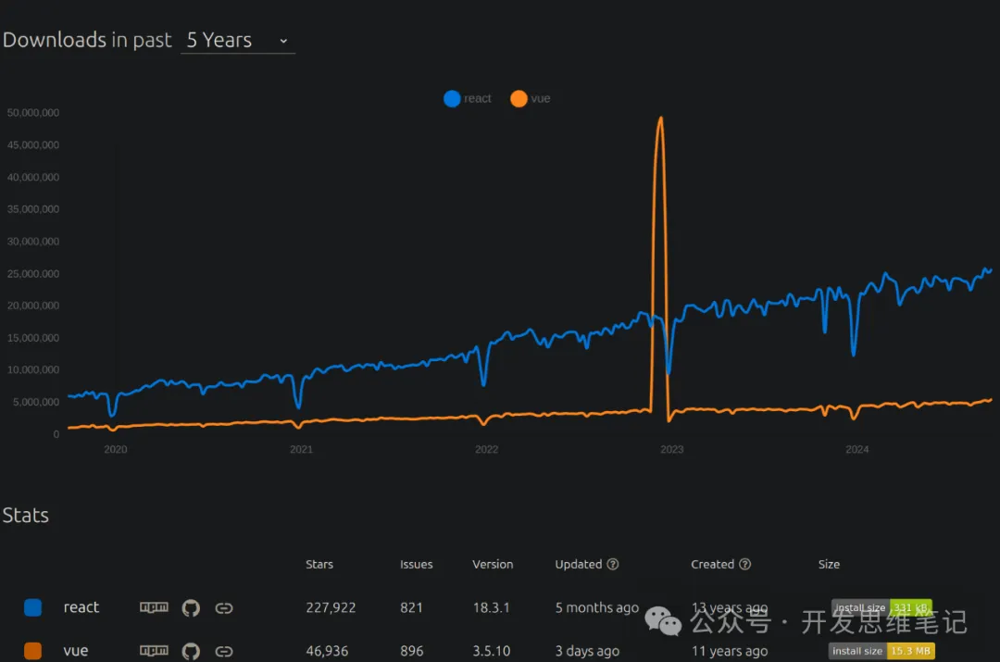

作为一名前端开发新手，你可能已经掌握了 HTML、CSS 和 JavaScript 这些基础技能。但当你准备深入前端开发时，会发现如今的前端生态系统有着琳琅满目的框架和工具选择——React、Vue、Next.js、Tailwind CSS、Three.js、Appium、Electron、jQuery、Node.js、Webpack、Globalize 等等。每一个都似乎值得去学习，但问题是，作为初学者，**该选择哪个呢？**

在本文中，我将为你梳理这些选择背后的逻辑，并分享我最终选择 React 作为开发项目的起点。**准备好了吗？让我们一起踏上从 React 入门到精通的学习之旅！**

## 为什么选择框架如此重要？
前端开发框架的选择不仅仅影响到你未来的开发体验，还决定了你能多快上手项目、能否顺利进入职场以及与团队的协作方式。随着技术的发展，越来越多的企业已经明确了自己的前端技术栈，而作为开发者，选择一个符合行业趋势、生态完善的框架，能让你事半功倍。

## React 和 Vue 的对比
### React：Facebook 出品，社区强大
- 优势：React 由 Facebook 维护，拥有庞大的社区和丰富的第三方库生态。它以组件化和虚拟 DOM 为核心概念，具有极高的可扩展性和灵活性。
- 应用场景：React 的灵活性使其特别适合构建大型应用，同时它也是跨平台框架 React Native 的基础，这意味着你学会 React 后，还能拓展到移动开发领域。
- 学习难度：相对 Vue 来说，React 的上手门槛略高，尤其是需要结合使用如 Redux 等状态管理库时。

### Vue：轻量易学，渐进式框架
- 优势：Vue 的学习曲线平滑，非常适合新手入门。它设计简洁，提供了比 React 更清晰的结构和更快的上手体验。
- 应用场景：Vue 的灵活性和轻量级特性非常适合中小型项目，同时它在中国的应用非常广泛，尤其在一些小型创业公司中。
- 学习难度：Vue 内置了许多开发便捷性功能，相比 React，学习成本低、开发效率高。

## 如何做出选择？
> 作为初学者，面对 React 和 Vue，如何选择呢？以下几个因素可以帮助你做出决策：

1. 未来发展方向：如果你未来希望从事大型项目开发，或者希望拥有更广泛的职业选择，React 由于社区活跃和使用广泛，是更优的选择。
1. 学习成本：如果你想快速上手并构建小型项目，那么 Vue 是个不错的选择，它的学习曲线相对平滑。
1. 生态系统：React 的生态比 Vue 更加丰富，特别是与 React Native 的结合，可以让你轻松跨平台开发，涵盖 Web 和移动端。

## 为什么我选择了 React？
> 在深入了解了 React 和 Vue 的优缺点后，我最终选择了 React。以下是我的理由：
- 行业趋势：React 的使用范围极广，无论是初创公司还是大型企业都在使用 React 技术栈。学会 React，可以让我更好地融入实际开发环境。
- 生态系统成熟：React 生态体系庞大，配合 React Native 可以快速转向移动端开发，为我未来拓展职业方向提供了更多可能性。
- 灵活性：虽然上手稍有难度，但一旦掌握了 React，我能更自如地构建大型应用，同时还能定制化开发体验。

## 准备好开始你的 React 学习之旅了吗？
既然已经选定了 React，接下来就让我们一起从头开始，深入学习 React 的核心概念和实际应用技巧。我将带你从入门到精通，一步步攻克 React 的知识难点，帮助你快速掌握这一前端必备技术。

**敬请期待下一篇：React 入门基础篇！**

## 总结
前端框架的选择并没有标准答案，关键在于你的需求和未来规划。对于我而言，React 的广泛应用和强大的生态系统是最具吸引力的。当然，无论你选择 React 还是 Vue，最重要的是专注于深入学习，将知识应用到实践中。

如果你觉得有帮助，别忘了关注、支持和赞赏哦！😄