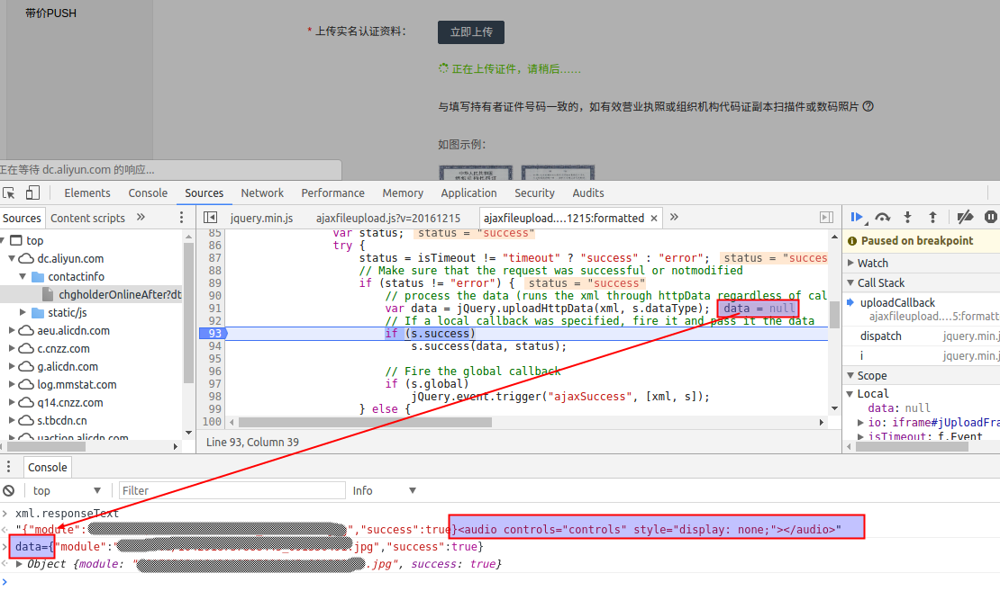

### 问题
阿里云控制台所有涉及图片上传[ajaxfileupload.js][]的地方上传后出现：“上传的图片失败，请重试”的错误

### 环境
- xubuntu 16.04.2 LTS, 64位
- google-chrome --version：Google Chrome 58.0.3029.81
- 碰到过问题的页面：域名实名认证上传证件、域名所有者修改中上传证件

### 解决
#### 分析定位问题
- chrome中按F12
- 在[ajaxfileupload.js][]中解析ajax结果`var data = jQuery.uploadHttpData(xml, s.dataType)`之后第94行`if (s.success)`处设置断点
- 在[ajaxfileupload.js][]中第5行handleError函数中`if (s.error) {`设置断点
- 重新刷新页面，上传图片，进入断点，后查看：xml.responseText的值发现前面是json，但是最后跟了一串html，所以**虽然上传成功但是数据转json必然异常**

#### 解决
- 思路：在原来解析data后，手动设置data的值为正确的json数据
- 重新刷新页面，重新上传图片，进入94行的解析ajava结果断点，在console中设置正确的data数据：`data={"module":"**/*.jpg","success":true}`，继续运行，提示图片上传成功

[ajaxfileupload.js]: https://dc.aliyun.com/static/js/ajaxfileupload.js?v=20161215